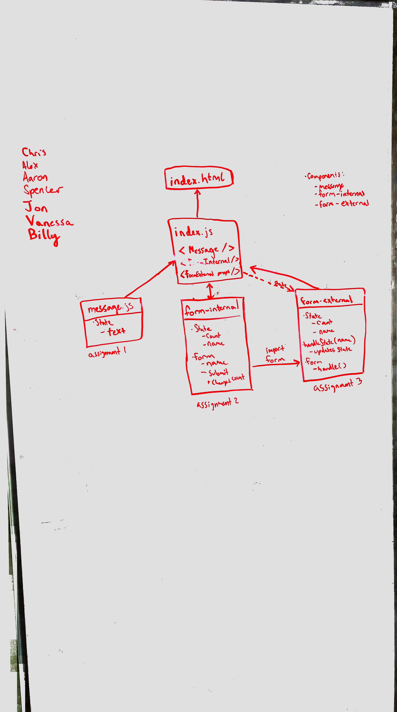

 LAB 28
=================================================

## Props and State

### Author: Alexander

### Links and Resources
* [Repo](https://github.com/alex-white-401-advanced-javascript/lab-28)
* [Assignment 1 PR](https://github.com/alex-white-401-advanced-javascript/lab-28/pull/1)
* [Assignment 2 PR](https://github.com/alex-white-401-advanced-javascript/lab-28/pull/2)
* [Assignment 3 PR](https://github.com/alex-white-401-advanced-javascript/lab-28/pull/3)

#### Assignment 1 - Props Practice
* [Codesandbox index.js](https://codesandbox.io/s/xo2w2w1w1o)
* [CodeSandBox Modular](https://codesandbox.io/s/xrj807rv2o)

#### Assignment 2 - Internal State
* [Codesandbox index.js](https://codesandbox.io/s/6yx43qkvz3)
* [CodeSandBox Modular](https://codesandbox.io/s/womjkry10k)

#### Assignment 3 - External State
* [Codesandbox index.js](https://codesandbox.io/s/github/alex-white-401-advanced-javascript/lab-28/tree/state_external)
* [CodeSandBox Modular](https://codesandbox.io/s/mjnrq3q59x)

### UML

<!-- #### Documentation
* [swagger](http://xyz.com) (API assignments only)
* [jsdoc](http://xyz.com) (All assignments) -->

<!-- ### Modules
#### `modulename.js`
##### Exported Values and Methods

###### `foo(thing) -> string`
Usage Notes or examples

###### `bar(array) -> array`
Usage Notes or examples

### Setup

#### Running the app
* `npm start`
* Endpoint: `/`
  
#### Tests
* How do you run tests? `npm test`
* What assertions were made?

* What assertions need to be / should be made? -->

